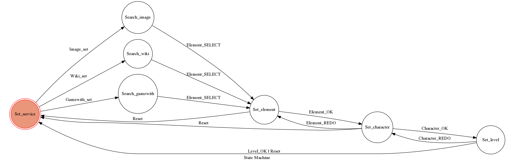

# TOC Final Project 2017

A telegram bot based on a finite state machine

It can be used to search the image or information of characters in the social game **Granblue Fantasy**.

## Setup

### Prerequisite
* Python 3

#### Install Dependency

* pygraphviz (For visualizing Finite State Machine)
    * [Setup pygraphviz on Ubuntu](http://www.jianshu.com/p/a3da7ecc5303)

### Secret Data

`TOKEN` in Chat_Bot.py **MUST** be set to proper values.
Otherwise, you might not be able to run your code.


#### Run the sever

```sh
python3 Chat_Bot.py
```

## Finite State Machine


## Usage
The initial state is set to `Service`.

Every while loop, the program uses getUpdates which is the API of telegram to check whether there is a new message send by user.

If there is a new user,the program generates a new state machine for this user

Every time,program send user a `one time keyboard`.

User use this keyboard to input some message

* user
	* Input: "go to state1"
		* Reply: "I'm entering state1"

	* Input: "go to state2"
		* Reply: "I'm entering state2"


## Author
[Bisyuu](https://github.com/Bisyuu)
